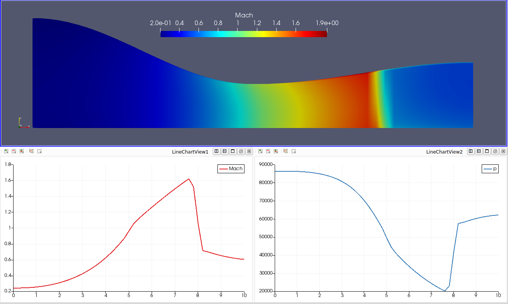

# Thực hành CFD với Python! VnCFD_2D_v2!

**VnCFD_2D_v2** là chương trình mô phỏng khí động lực học chuyển động dòng chảy không nhớt trong không gian hai chiều, giải hệ phương trình Euler 2D. So với phiên bản 1 **VnCFD_2D_v1**, phiên bản hai có nhiều thay đổi. Các thay đổi chính bao gồm:

* Sử dụng python3.7.
* Tăng tốc độ tính toán lên **gấp 5 lần** bằng cách sử dụng hàm tính dòng được viết trên ngôn ngữ **FORTRAN**, so với việc sử dụng hàm dòng viết bằng Python.
* Cấu trúc dữ liệu thay đổi để phù hợp với lưới nhiều blocks.
* Mở rộng thêm các điều kiện biên để phù hợp với lưới nhiều block, để có thể đặt nhiều điều kiện biên trên một biên, và thêm các điều kiện biên subsonic.
* Rút gọn các lệnh chạy chương trình, việc sử dụng chương trình trở nên rất thuận tiện.

[Hướng dẫn sử dụng](https://nbviewer.jupyter.org/github/SangVn/VnCFD_2D_v2/blob/master/Tutorial.ipynb) 

